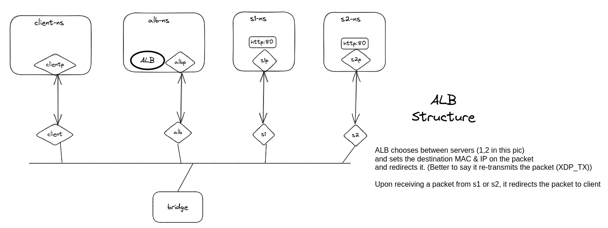

# bfp load balancer

## Notes

1. The project is inspired by [lizrice lb from scratch](https://github.com/lizrice/lb-from-scratch)
   and [katran](https://github.com/facebookincubator/katran)

2. ALB uses xdp-generic mode. Using xdp-native mode requires extra work such as attaching a dummy xdp_pass program to
   all involved interfaces. Refer
   to [this](https://github.com/xdp-project/xdp-tutorial/tree/master/packet03-redirecting#sending-packets-back-to-the-interface-they-came-from)
   for more explanation.

## Structure


## Prerequisites

### Install bpf2go

```shell
go install github.com/cilium/ebpf/cmd/bpf2go@latest
```

### Install libbfp

```shell
git clone https://github.com/libbpf/libbpf.git /tmp/libbpf
cd /tmp/libbpf/src
make -j`nproc`
BUILD_STATIC_ONLY=1 NO_PKG_CONFIG=1 make install
```

### Install bpftool

```shell
rm /usr/sbin/bpftool

apt update && apt install -y git
cd / && git clone --recurse-submodules https://github.com/libbpf/bpftool.git

cd bpftool/src
make install

ln -s /usr/local/sbin/bpftool /usr/sbin/bpftool
```

### Generate bpf2go boilerplate

```shell
make generate
```

## Develop

### Setup environment

```shell
make setup-dev-env
```

### Run

```shell
make run-in-ns NS=alb
```

### Send Request to ALB

Make sure http servers are listening on port 80 in ns1 and ns2, then run:

```shell
sudo ip netns exec client curl 172.16.31.2
```

### Clean environment

```shell
make clean-dev-env
```
